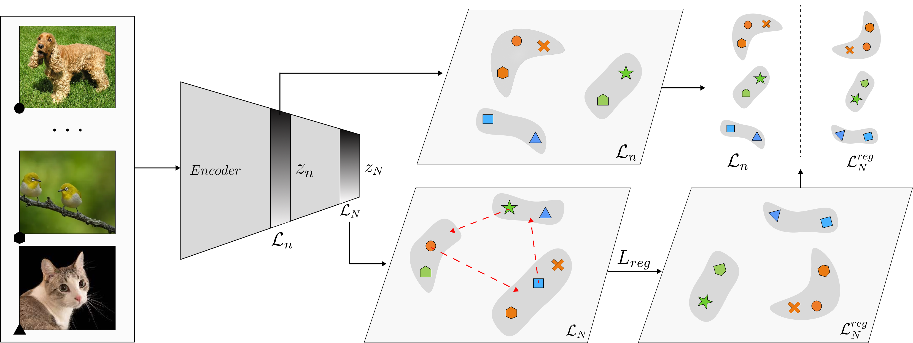
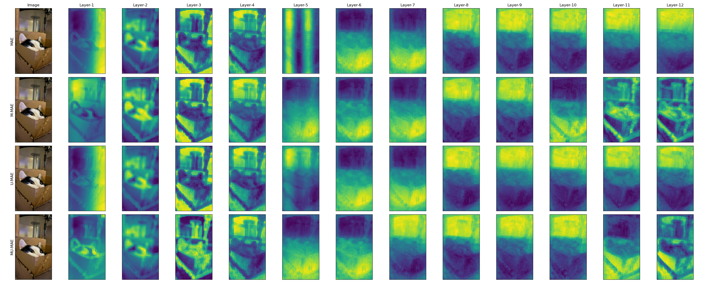
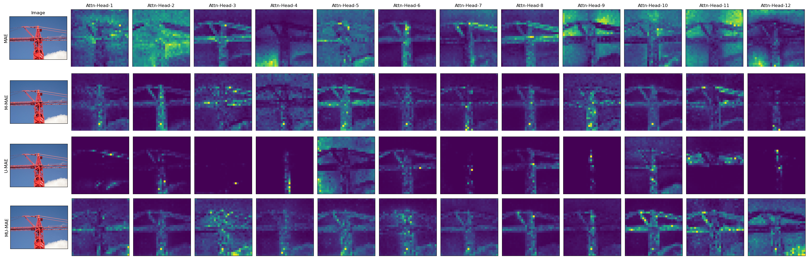

# MAGMA: Manifold Regularization for MAEs

This repository contains the code for our paper **MAGMA: Manifold Regularization for MAEs**.

- **Accepted in WACV 2025**

MAGMA is a novel regularization technique that enhances self-supervised representation learning within masked autoencoders (MAE). The core of our approach lies in applying a manifold-based loss term that encourages consistency and smoothness between representations across different layers of the network. 



This codebase builds upon the [solo-learn repository](https://github.com/vturrisi/solo-learn).

## Abstract
Masked Autoencoders (MAEs) are an important divide in self-supervised learning (SSL) due to their independence from augmentation techniques for generating positive (and/or negative) pairs as in contrastive frameworks. Their masking and reconstruction strategy also nicely aligns with SSL approaches in natural language processing. Most MAEs are built upon Transformer-based architectures where visual features are not regularized as opposed to their convolutional neural network (CNN) based counterparts, which can potentially hinder their performance. To address this, we introduce \magma{}, a novel batch-wide layer-wise regularization loss applied to representations of different Transformer layers. We demonstrate that by plugging in the proposed regularization loss, one can significantly improve the performance of MAE-based models. We further demonstrate the impact of the proposed loss on optimizing other generic SSL approaches (such as VICReg and SimCLR), broadening the impact of the proposed approach.

## Installation
For installaing the environment follow the steps outlined in [solo-learn's README](solo/README.md)

## Usage
### Data Preparation

Prepare your datasets (e.g., ImageNet, CIFAR-100) following the instructions in the solo-learn repository.

### Training
To train an MAE model with MAGMA regularization, use the following command:

```bash
python main_pretrain.py --config-path scripts/pretrain/imagenet --config-name mae-reg-uniformity.yaml 
```

You can modify the [configuration file](scripts/pretrain/imagenet/mae-reg-uniformity.yaml) to adjust hyperparameters, dataset paths, and other settings.

Important parameters:
- `uniformity_weight`: Set to 0.01 to apply U-MAE's regularization. Set to 0 otherwise.
- `reg_scheduler`: Used to apply the `MAGMA` loss. 

## Results
| Method           | CIFAR-100 (linear) | CIFAR-100 (k-nn) | STL-10 (linear) | STL-10 (k-nn) | Tiny-ImageNet (linear) | Tiny-ImageNet (k-nn) | ImageNet-100 (linear) | ImageNet-100 (k-nn) |
| ---------------- | ------------------ | ---------------- | --------------- | ------------- | ---------------------- | ---------------------- | --------------------- | --------------------- |
| MAE              | 38.2               | 36.6              | 66.5            | 62.0          | 17.8                  | 17.7                  | 58.0                 | 47.5                 |
| **M-MAE (ours)** | **43.3**            | **40.7**           | **71.0**         | **65.9**       | **20.9**               | **20.5**               | **69.0**              | **49.8**              |
| U-MAE            | 45.3               | 45.9              | 74.9            | 72.1          | 21.5                  | 19.0                  | 69.5                 | 56.8                 |
| **MU-MAE (ours)** | **46.4**            | **46.4**           | **75.6**         | **73.0**       | **25.2**               | **23.9**               | **73.4**              | **60.1**              |
| SimCLR           | 62.8               | 58.7              | 90.4            | 86.9          | 50.9                  | 43.5                  | 67.8                 | 65.3                 |
| **M-SimCLR (ours)** | **63.2**            | **59.4**           | **90.5**         | **86.9**       | **51.0**               | **44.6**               | **68.7**              | **65.6**              |
| VICReg           | 63.6               | 60.8              | 87.4            | 84.5          | 45.2                  | 40.5                  | 68.4                 | 62.1                 |
| **M-VICReg (ours)** | **64.7**            | **61.9**           | **87.4**         | **84.5**       | **45.8**               | **40.5**               | **70.4**              | **65.1**              |

**Table notes**: Linear probing accuracy and k-nn accuracy (k=10) of models pre-trained and evaluated on the given datasets. Adding the proposed regularisation term to the baseline method generally increases performance.

**Key takeaways from the table:**

*   Adding the proposed MAGMA regularisation to the baseline MAE method leads to significant improvements in both linear and k-nn accuracy across all datasets.
*   While the improvements are smaller in magnitude, MAGMA also benefits U-MAE, a variant of MAE that already includes a regularisation term.
*   The impact of MAGMA on SimCLR and VICReg is less pronounced, showing only marginal improvements. This suggests that MAGMA is most effective when applied to MAE-based methods.
*   The bolded rows highlight the models using the proposed MAGMA regularisation.

### Qualitative results

These figures provide visual insights into how MAGMA enhances MAE models.

#### Less Noise, Better Features

This shows the most important features learned by different ViT-B models (using PCA). You'll notice **M-MAE (trained with MAGMA) has significantly less noise in its features** compared to the baseline MAE, especially in the initial and final layers.  This means MAGMA helps the model learn cleaner, more meaningful information. 

#### Focused Attention = Better Understanding

Attention maps reveal where the model focuses when looking at an image. This figure compares attention maps from different models:

*   **Baseline MAE often gets distracted by the background.**
*   **MAGMA-trained models (M-MAE and MU-MAE) show a clear difference.** They either focus on the main object **or** the background, but rarely both simultaneously. This demonstrates a **more focused and semantically aware attention**, leading to improved performance. 


## Citation
```(bibtex)
TODO
```

## Acknowledgements
This codebase builds upon the excellent work of the solo-learn repository. We thank the authors for their valuable contribution to the self-supervised learning community.

## License
This project is licensed under the MIT License.
